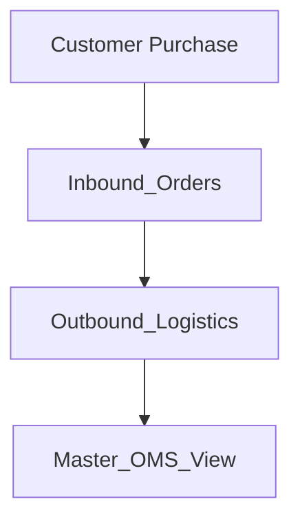

# OMS Operations Manual
## G·GRIP Order Management System

This system tracks every order from sale → shipment → delivery using three main sheets.

### Workflow Diagram



### Quick Visual Workflow

```text
Sales Email Received
        ↓
Inbound_Orders (Automatic)
        ↓
Warehouse
  - Allocate serial
  - Scan serial
        ↓
Outbound_Logistics
  - Add tracking
  - Update shipment dates
        ↓
Customer notified automatically
        ↓
Dashboard monitoring
```

## 1. Inbound_Orders (Sales & Product Information)

### Purpose
This sheet records every item sold. Each row represents one product in an order. If a customer buys 3 clubs in one cart, there will be 3 rows.

### What gets filled automatically
These fields are created automatically by the system:

| Field | Meaning |
| :--- | :--- |
| merchant-order-id | Order number from source system |
| merchant-order-item-id | Unique item ID within the order |
| line-item-index | Position of item in cart |
| purchase-date | Date order was created |
| purchase-time | Time of purchase |
| order-created-at | Exact timestamp (ISO 8601) |
| customer-id | Internal customer identifier (CYYYYMMDD-###) |
| system-gmail-id | Email ID used for deduplication |
| source-system | Platform (samcart, shopify, or imweb) |
| oms-order-id | Internal canonical order ID |
| oms-order-item-id | Internal canonical item ID |
| buyer-email-hash | Privacy-safe SHA-256 email hash |
| parse-status | Parsing result (OK or ERROR) |

### Customer Information
These fields identify the buyer.

| Field | Meaning |
| :--- | :--- |
| buyer-email | Customer email |
| buyer-name | Customer full name |
| buyer-phone-number | Normalized phone number |
| recipient-name | Shipping recipient name |

### Product Details
These describe the club purchased.

| Field | Meaning |
| :--- | :--- |
| sku | Internal product SKU (GG-Model-Club-HandFlex-Length-Grip-Mag) |
| product-name | Product name |
| model | Basic / Pro |
| club-type | Club type (Wood / Iron / 7-iron) |
| product-category | Product classification (default: Golf Club) |
| hand | Right / Left |
| flex | Shaft flex (L, R, S, X) |
| shaft-length-option | Standard / Longer |
| grip-size | Standard / Mid |
| mag-safe-stand | Whether stand is included (Yes / 0) |

### SKU Legend
| Code | Meaning |
| :--- | :--- |
| BAS | Basic |
| PRO | Pro |
| IR | Iron |
| WD | Wood |
| RS | Right Stiff |
| RR | Right Regular |
| LS | Left Stiff |
| LR | Left Regular |
| ST | Standard |
| LG | Longer |
| MS | Mid-size Grip |

### Financial Fields
These represent the transaction values.

| Field | Meaning |
| :--- | :--- |
| currency | USD / KRW |
| item-price | Club price |
| item-tax | Sales tax |
| shipping-price | Shipping charge |
| discount-amount | Discount applied |
| refund-amount | Refunds issued |
| total-amount | Total payment |

### Shipping Address
Customer shipping destination.

| Field | Meaning |
| :--- | :--- |
| ship-address-1 | Street address |
| ship-city | City |
| ship-state | State |
| ship-postal-code | ZIP / Postal Code |
| ship-country | Country |
| ship-service-level | Shipping service level |

### Operational Fields
Used internally for order lifecycle.

| Field | Meaning |
| :--- | :--- |
| serial-number-allocated | Assigned club serial number |
| item-life-cycle | ACTIVE / REFUNDED / RETURNED / REPLACED / CANCELLED |
| order-life-cycle | ACTIVE / PARTIAL_REFUND / FULL_REFUND / CANCELLED |
| replacement-* | Replacement tracking (for ID, item ID, type, group ID) |
| notes | Human notes |
| automation-notes | Script notes |

## 2. Outbound_Logistics (Shipment Tracking)

### Purpose
Tracks how the order moves through the shipping pipeline. Each row represents one shipment for one order item. Outbound rows are automatically created when inbound rows appear.

### Identity Fields
These connect the shipment to the original order.

| Field | Meaning |
| :--- | :--- |
| merchant-order-id | Source system order ID |
| merchant-order-item-id | Line item ID |
| oms-order-id | Internal order ID |
| oms-order-item-id | Internal item ID |
| shipment-id | Unique shipment identifier |

### Workflow Information
| Field | Meaning |
| :--- | :--- |
| outbound-workflow-type | Shipment type (DIRECT_SHIP, RESHIP, etc.) |
| outbound-status | Current stage of shipment |

**Typical lifecycle:**
`CREATED` → `KR_SHIPPED` → `HUB_RECEIVED` → `US_SHIPPED` → `DELIVERED`

### Shipping Stages
These fields record when the package reaches each step.

| Field | Meaning |
| :--- | :--- |
| domestic-tracking-kr | Korean courier tracking |
| hub-received-date | Arrival at export hub |
| hub-location | Hub city (Seoul / Busan / Los Angeles) |
| international-tracking-us | US carrier tracking (FedEx / UPS / USPS / DHL) |
| carrier-us | Carrier name |
| us-ship-date | Shipment departure date |
| delivered-date | Final delivery date |

### Shipment Timeline
| Field | Meaning |
| :--- | :--- |
| stage-timeline | Human-readable event history |

*Example:*
`CREATED — 2026-03-01`
`Hub Received — 2026-03-03`
`US Shipped — 2026-03-04`
`Delivered — 2026-03-06`

### Serial Number Verification
| Field | Meaning |
| :--- | :--- |
| serial-number-scanned | Serial scanned in warehouse |
| sn-verify | OK / MISMATCH / ERROR |
| notes | Issue notes |

### Customer Communication
| Field | Meaning |
| :--- | :--- |
| customer-email-status | Email status (Sent: Final Delivery / Error / SKIP) |
| last-email-at | When customer was notified |

*Note: Emails only trigger once international tracking is available.*

### Package Information
Used for logistics and shipping labels.

| Field | Meaning |
| :--- | :--- |
| package-type | standard-club / club-with-stand |
| actual-weight-kg | Shipping weight |
| package-length-cm | Length |
| package-width-cm | Width |
| package-height-cm | Height |
| delivery-country | Destination |

## 3. Meta / Dashboard (Master_OMS_View)

### Purpose
This sheet is the control center for operations and analytics. It combines information from Inbound and Outbound to show metrics and backlogs.

### Key Operational Metrics

#### Logistics Velocity
Measures shipping speed.

| Metric | Meaning |
| :--- | :--- |
| Avg Time to Hub | Purchase → hub arrival |
| Avg Customs Clearance | Hub → US ship |
| Avg Last Mile | US ship → delivery |
| Avg Click-to-Door | Purchase → delivery |

#### Operational Efficiency
Identifies bottlenecks.

| Metric | Meaning |
| :--- | :--- |
| Hub Backlog | Packages stuck at hub (KR tracking present, US tracking empty) |
| S/N Mismatch Count | Warehouse errors |
| Reshipment Rate | Orders ending in -RES |

#### Product Intelligence (Planned)
| Metric | Meaning |
| :--- | :--- |
| Mag-Safe Attachment Rate | Stand upsell rate |
| Flex Split | R vs S |
| Hand Split | Right vs Left |
| Model Popularity | Basic vs Pro |

#### Customer Metrics
| Metric | Meaning |
| :--- | :--- |
| Repeat Purchase Rate | Returning customers |
| Total LTV | Total spend per customer |
| Top Return Reason | Most frequent return reason |

## 4. Field Responsibilities

### System Managed Fields (Do NOT edit)
These fields are automatically generated and should never be edited manually. Editing these can break order tracking.
- `oms-order-id`
- `oms-order-item-id`
- `buyer-email-hash`
- `system-gmail-id`
- `line-item-index`
- `source-system`
- `source-order-id`
- `source-order-item-id`
- `system-created-at`
- `system-updated-at`
- `parse-status`

### Warehouse Managed Fields
Warehouse staff only interact with these fields.
- **Inbound_Orders**: `serial-number-allocated`
- **Outbound_Logistics**: `serial-number-scanned`

### Logistics Managed Fields
Logistics team updates these fields in **Outbound_Logistics**:
- `domestic-tracking-kr`
- `hub-received-date`
- `hub-location`
- `international-tracking-us`
- `carrier-us`
- `us-ship-date`
- `delivered-date`

## 5. Error Handling

### S/N Mismatch
If `sn-verify` = `MISMATCH`:
1. Stop shipment
2. Verify scanned serial number
3. Check `serial-number-allocated`
4. Correct the serial entry
5. Update notes with the resolution

### Missing Address
If shipping address fields are highlighted:
1. Check the original order email
2. Correct the address manually
3. Save changes

### Hub Backlog
If `domestic-tracking-kr` exists but `international-tracking-us` is blank:
This means the package is stuck at the hub. Logistics should verify:
- Customs clearance
- Handoff to US carrier

## 6. Replacement / Reship Process

If a shipment must be replaced:
1. Create a new outbound shipment row
2. Set `outbound-workflow-type` = `RESHIP`
3. Set `original-merchant-order-id` = original order id
4. Set `original-merchant-order-item-id` = original item id
5. Add a note explaining the reason (e.g., Damage, Warranty, Lost shipment).

## Daily Workflow for the Team

### Step 1 — Sales ingestion
Email arrives (SamCart, Shopify, or Imweb). The system automatically adds rows to `Inbound_Orders` and creates stubs in `Outbound_Logistics`. No manual work required.

### Step 2 — Warehouse fulfillment
Warehouse staff allocate a serial number, scan it during packing, and add outbound tracking. This updates `Outbound_Logistics`.

### Step 3 — Shipping updates
Logistics team updates `hub-received-date`, `international-tracking-us`, and `delivered-date`. The `stage-timeline` automatically updates.

### Step 4 — Dashboard monitoring
Operations monitors `Master_OMS_View` to check for backlogs, shipping delays, errors, and product demand.

## 7. Daily Health Check
Each morning operations should review:
- **Hub Backlog**
- **S/N Mismatch alerts**
- **Parse Errors**
- **Orders missing outbound rows**
- **Orders without tracking numbers**

*This takes ~2 minutes and prevents most shipping issues.*

## 8. Data Integrity Rules

**Never:**
- Delete rows from `Inbound_Orders`
- Change `merchant-order-id`
- Change `oms-order-id`
- Manually edit `shipment-id`

*If corrections are needed, add notes instead.*

## Summary
The OMS separates responsibilities into three layers:

**Inbound_Orders** (Sales Data)
↓
**Outbound_Logistics** (Shipment Operations)
↓
**Master_OMS_View** (Operations + Analytics)

This structure ensures clean sales data, reliable shipment tracking, and clear operational visibility.

# Automation Process & Workflow Report

The G·GRIP OMS is designed for "zero-touch" order ingestion and highly automated logistics tracking. Below is the technical and operational report of the full automation workflow.

## 1. Sales Ingestion (Zero-Touch)
The system monitors specific Gmail labels for three primary sales channels: **SamCart**, **Shopify**, and **Imweb**.
- **Polling:** Script functions (`inbound_runSamCart`, etc.) are triggered (manually or via time-based triggers) to scan "To Process" labels.
- **Parsing:** The system uses robust regex and text-cleaning logic (`ultraCleanText_`) to extract order IDs, customer details, shipping addresses, and product specs from email bodies.
- **Deduplication:** Uses `system-gmail-id` and `oms-order-item-id` to prevent duplicate entries if an email is re-processed.
- **Address Normalization:** A global address parser (`parseGlobalAddress`) standardizes addresses across US, UK, EU, KR, and JP formats.

## 2. Identity & Privacy Layer
- **Customer ID Generation:** Automatically assigns a unique ID (`CYYYYMMDD-###`) to new customers while recognizing returning customers via email lookup.
- **Privacy Hashing:** Generates a SHA-256 `buyer-email-hash` for secure customer tracking across systems without exposing PII in every view.
- **Canonical IDs:** Maps disparate source system IDs into a unified OMS format (`source-system:order-id:item-id`).

## 3. Warehouse Fulfillment & Outbound Stubs
- **Automatic Stub Creation:** As soon as an order is ingested into `Inbound_Orders`, a corresponding "stub" is created in `Outbound_Logistics`.
- **Packaging Defaults:** The system automatically calculates package weight and dimensions based on the product (e.g., standard club vs. club-with-stand).
- **S/N Allocation:** Warehouse staff allocate serial numbers in `Inbound_Orders`.
- **S/N Verification:** When a serial number is scanned in the warehouse (`Outbound_Logistics`), the system automatically verifies it against the allocation and flags `MISMATCH` or `OK`.

## 4. Logistics & Tracking Automation
- **Status Progression:** The `outbound-status` updates automatically as dates are entered:
  - `hub-received-date` → `HUB_RECEIVED`
  - `us-ship-date` → `US_SHIPPED`
  - `delivered-date` → `DELIVERED`
- **Linkification:** Tracking numbers for LOGEN, FedEx, UPS, USPS, and DHL are automatically converted into clickable rich-text links.
- **Stage Timeline:** A human-readable history (`stage-timeline`) is deterministically rebuilt every time a logistics milestone is reached.

## 5. Automated Communication
- **Customer Notifications:** Once an international tracking number is added, the system automatically sends a "Final Delivery" email to the customer using a branded HTML template.
- **Slack Alerts:** Real-time notifications are sent to Slack for:
  - New order arrivals (with full item breakdown).
  - Operational errors (S/N mismatches, parsing failures).
  - Hub backlogs or shipping exceptions.

## 6. Real-Time Analytics & Dashboard
- **Master Table Join:** The `Master_OMS_Table` automatically joins Inbound (Sales) and Outbound (Logistics) data using the `oms-order-item-id` as the primary key.
- **Dynamic Metrics:** The `Master_OMS_Dashboard` uses dynamic formulas to calculate:
  - **Logistics Velocity:** Average days for each shipping leg (Purchase → Hub → US → Door).
  - **Operational Health:** Hub backlog counts, S/N mismatch rates, and reshipment percentages.
  - **Financials:** LTV and Lost Revenue (refunds) filtered by the selected dashboard date range.
- **Dynamic Charting:** Inbound velocity and Outbound status charts update instantly based on the "Start Date" and "End Date" selected on the dashboard.
